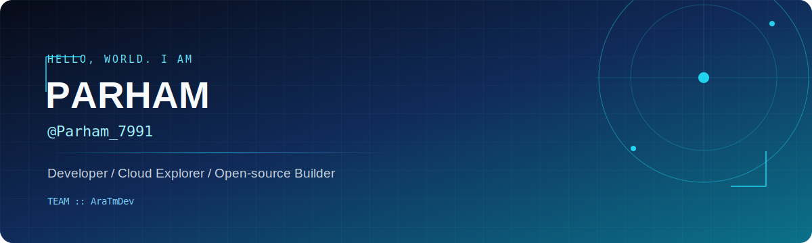

<!--
  ██████╗  █████╗ ██████╗ ██╗  ██╗ █████╗ ███╗   ███╗
  ██╔══██╗██╔══██╗██╔══██╗██║  ██║██╔══██╗████╗ ████║
  ██████╔╝███████║██████╔╝███████║███████║██╔████╔██║
  ██╔═══╝ ██╔══██║██╔══██╗██╔══██║██╔══██║██║╚██╔╝██║
  ██║     ██║  ██║██║  ██║██║  ██║██║  ██║██║ ╚═╝ ██║
  ╚═╝     ╚═╝  ╚═╝╚═╝  ╚═╝╚═╝  ╚═╝╚═╝  ╚═╝╚═╝     ╚═╝
-->

<p align="center">
  
</p>

<p align="center">
  <a href="https://github.com/parham7991"></a>
  <a href="https://t.me/parham_7991"></a>
  <a href="https://github.com/ARATmDev"></a>
</p>

<p align="center">
  
  
  
</p>

<br />

##  `whoami`

```yaml
name: Parham Khanmohammadi
handle: Parham_7991
team: AraTmDev
role: Developer / Builder
mission: Turning ideas into useful web, bot, and cloud-powered tools.
currently_exploring:
  - Developer cloud workstations
  - Automation and self-hosted infrastructure
  - Web interfaces and community tools
collaboration: Open to meaningful projects and new technical challenges.
```

> **سلام، من پرهام هستم.** عاشق ساختن ابزارهای کاربردی، یادگرفتن تکنولوژی‌های جدید و تبدیل ایده‌ها به پروژه‌های واقعی. این پروفایل دفتر کار من در دنیای اوپن‌سورس است.

##  Focus areas

<table>
  <tr>
    <td width="33%" valign="top">
      <h3 align="center">Web Engineering</h3>
      <p align="center"></p>
      <p align="center">Responsive interfaces, practical web utilities, and clean user experiences.</p>
    </td>
    <td width="33%" valign="top">
      <h3 align="center">Cloud & Infrastructure</h3>
      <p align="center"></p>
      <p align="center">Cloud environments, deployment workflows, relays, and infrastructure exploration.</p>
    </td>
    <td width="33%" valign="top">
      <h3 align="center">Community Automation</h3>
      <p align="center"></p>
      <p align="center">Bots and utilities built to make online communities more useful and enjoyable.</p>
    </td>
  </tr>
</table>

##  Selected repositories

<table>
  <tr>
    <td width="50%" valign="top">
      <a href="https://github.com/parham7991/railway-ubuntu-ssh-claude"></a>
    </td>
    <td width="50%" valign="top">
      <a href="https://github.com/parham7991/Vercel-XHTTP"></a>
    </td>
  </tr>
</table>

<p align="center">
  <a href="https://github.com/parham7991?tab=repositories"></a>
</p>

##  Contribution telemetry

<p align="center">
  
  
</p>

<p align="center">
  
</p>

##  The build log

```text
[✓] Building tools that solve real problems
[✓] Learning in public, one commit at a time
[✓] Shipping experiments instead of just collecting ideas
[→] Looking for the next thing worth building
```

##  Let’s connect

<p align="center">
  <a href="https://t.me/parham_7991"></a>
  <a href="https://github.com/parham7991"></a>
  <a href="https://github.com/ARATmDev"></a>
</p>

<p align="center">
  <code>Parham_7991</code> · <code>AraTmDev</code> · <i>Build. Learn. Repeat.</i>
</p>

<p align="center">
  
</p>

<!-- parham7991/parhamkhanmohammadi is the special repository that powers this profile. -->
